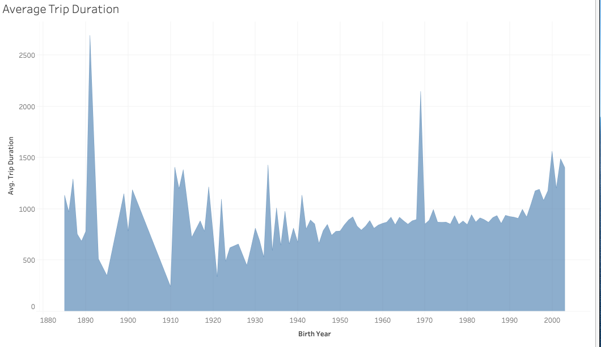
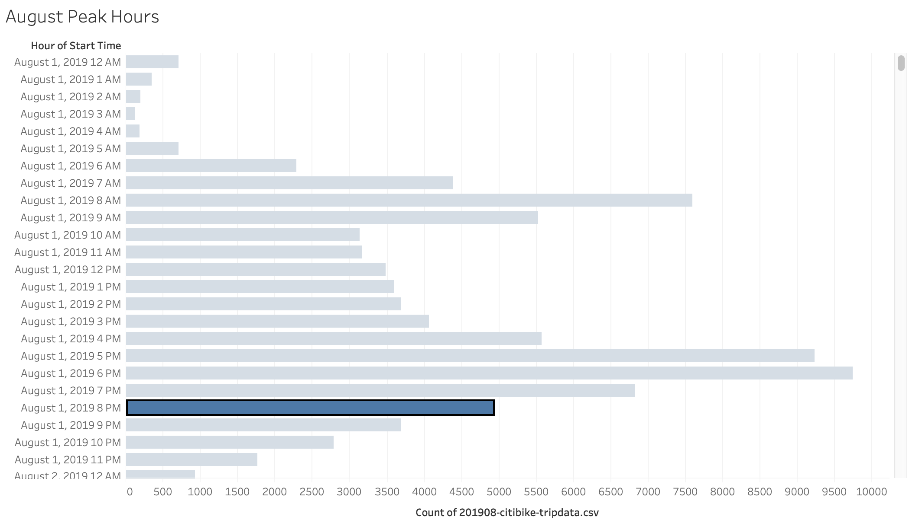
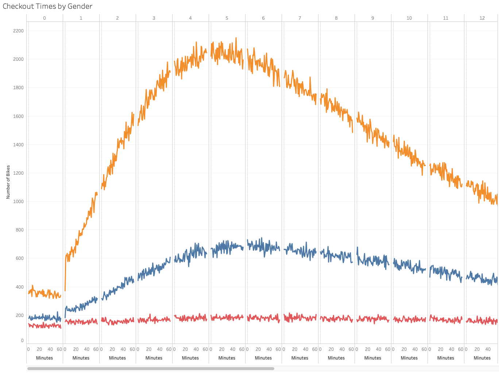
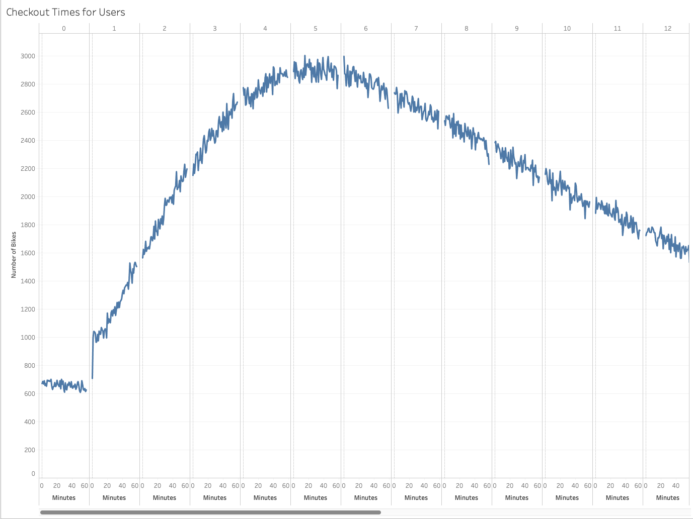
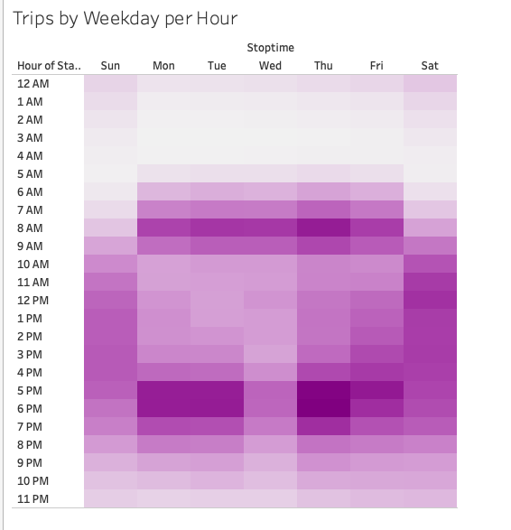
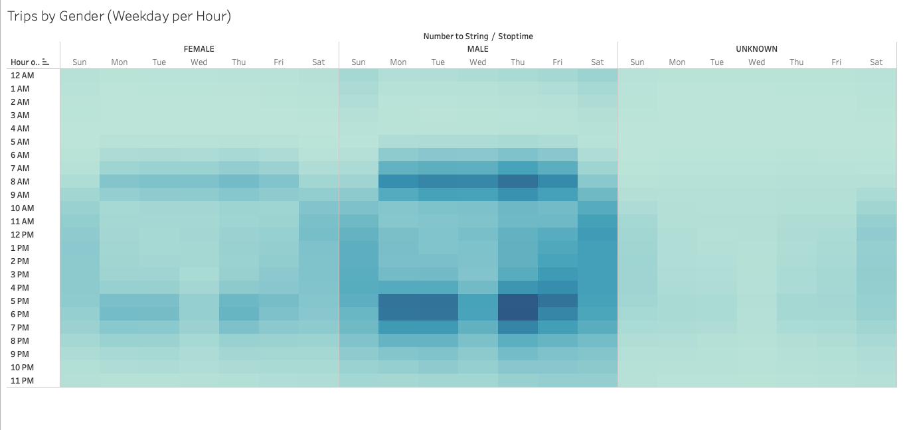
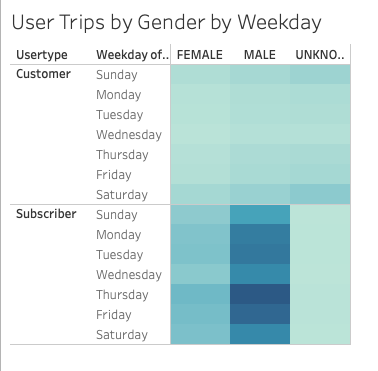

# Citi Bike- Bike Sharing

## Overview of the analysis
### Purpose: of this analysis.
The purpose of this analysis is to utilize the data captured from New York City to convince investors that a bike-sharing program in Des Moines is a solid business proposal. To solidify the proposal, one of the key stakeholders would like to see a bike trip analysis. With the analysis this will help support the case in creating the bike-sharing program in Des Moines. 

## Results
[Link to Dashboard](https://prod-useast-b.online.tableau.com/#/site/taniasite/views/Citibike_Challenge/CitiBikeChallengeStory?:iid=1)

Please refer to CitiBike Challenge Story

The result of this chart shows that the younger generation ride longer.

The result of this chart shows that there a lot of biking activity in August around 7-9 am and 4-9 pm.

The result of this chart shows that male will check out the bikes longer than females.

The result of this chart shows that majority of the bike riders used bikes for 4-7 hours trip duration.

The result of this chart shows that during the weekday, there are more rides from 6-8 am and 5-7 pm. Compared to weekends, there are more bike activity from 7 am -7 pm.

The result of this chart shows that male have a more activity during the weekday 6-9 am and 4-7 pm as for females activity from 7-9 am and 5-6pm. As for the weekends, the males have more activity from 8am-7pm as for females 10-1pm. 

The result of this chart whos that males and females who are subscribers ride more, specifically males subscibers ride more all week the most on Thursday.

## Summary
After the level analysis, I believe Des Moines will be successful in the bike sharing program. Males and Females will both ride as per the charts, majority will be male as they will ride longer and will utilize the program. Male using in NYC was high this will have the same affect in Des Moines. Two additional visualizations that I would perform would be compare the gender and age of bike riders in a line chart and another visualization would be usertype and duration of riding in a pie chart.

